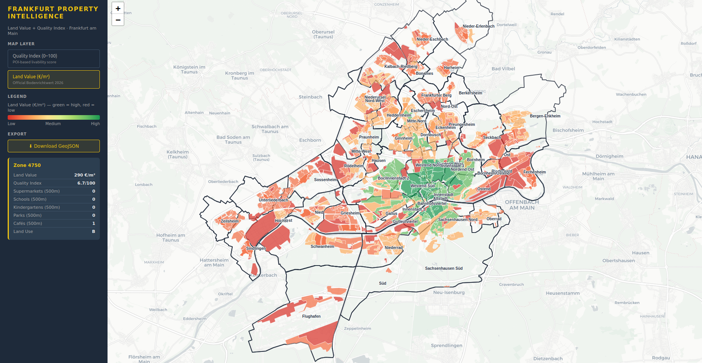

# Frankfurt Property Intelligence

An interactive geospatial web application that combines official land value data (Bodenrichtwerte) with a POI-based quality of life index to support real estate decision-making in Frankfurt am Main.



---

## What It Does

This tool answers a key question for real estate investors, urban planners and families:

> *Where in Frankfurt are land values still low but the quality of life already high?*

By combining two data sources — official cadastral land values and OpenStreetMap POI data — the application calculates a **Quality Index** for each land parcel and visualizes both layers on an interactive map.

---

## Quality Index

For each land value zone, the tool counts amenities within a 500m radius of the zone centroid and calculates a weighted score:

| Category | Weight | Source |
|---|---|---|
| Supermarkets | 20% | OpenStreetMap |
| Schools | 25% | OpenStreetMap |
| Kindergartens | 20% | OpenStreetMap |
| Parks | 15% | OpenStreetMap |
| Cafés & Restaurants | 20% | OpenStreetMap |

```
score per category = min(count / 3, 1.0)
Quality Index = weighted sum × 100  →  0 to 100
```

---

## Data Sources

| Data | Source | Format |
|---|---|---|
| Bodenrichtwerte 2026 | Geoportal Hessen (WFS) | GML → PostGIS |
| POIs | OpenStreetMap via osmnx | GeoDataFrame → PostGIS |
| District boundaries | OpenStreetMap via osmnx | GeoDataFrame → PostGIS |

---

## Key Insights from the Map

- **Green + low land value** → undervalued areas with good infrastructure → gentrification potential
- **Red + high land value** → overpriced areas with poor amenity access
- **Green + high land value** → established prime locations (Westend, Innenstadt)
- **Red + low land value** → investment risk zones

---

## Features

- Interactive choropleth map with two layers: Quality Index and Land Value
- Click on any zone to see detailed POI counts and land value
- District boundary overlay with labels
- GeoJSON export of full dataset
- REST API with FastAPI
- Fully containerized PostGIS via Docker
- Reproducible environment via conda

---

## Tech Stack

| Layer | Tool |
|---|---|
| Database | PostgreSQL + PostGIS (Docker / Supabase) |
| ETL | osmnx · GeoPandas · OWSLib · Python |
| Spatial Analysis | PostGIS · GeoPandas |
| API | FastAPI · SQLAlchemy |
| Frontend | Leaflet.js · HTML/CSS |
| Deployment | Docker Compose |
| Environment | conda |

---

## Architecture

```
WFS Hessen (Bodenrichtwerte)
OpenStreetMap (POIs, Districts)
        ↓
ETL Pipeline (Python)
        ↓
PostGIS Database
        ↓
Quality Index Calculation
        ↓
FastAPI REST API
        ↓
Leaflet Frontend
```

---

## API Endpoints

| Endpoint | Description |
|---|---|
| `GET /api/zones` | All land value zones with quality index as GeoJSON |
| `GET /api/stadtteile` | Frankfurt district boundaries |
| `GET /api/stats` | Summary statistics |
| `GET /api/export/geojson` | Download full dataset as GeoJSON |

API docs: `http://localhost:8000/docs`

---

## Installation

### Requirements
- Docker
- conda

### Setup

```bash
git clone https://github.com/tullah-gis/frankfurt-property-intelligence.git
cd frankfurt-property-intelligence

# Start PostGIS
docker compose up -d

# Create environment
conda env create -f environment.yml
conda activate property-intel

# Load data
python -m backend.etl.load_bodenrichtwerte
python -m backend.etl.load_pois
python -m backend.etl.calculate_index

# Start API
uvicorn backend.main:app --reload
```

Open `frontend/index.html` in your browser.

---

## Project Structure

```
frankfurt-property-intelligence/
├── docker-compose.yml
├── requirements.txt
├── environment.yml
├── backend/
│   ├── main.py
│   ├── database.py
│   ├── routes/
│   │   └── properties.py
│   └── etl/
│       ├── load_bodenrichtwerte.py
│       ├── load_pois.py
│       └── calculate_index.py
├── frontend/
│   └── index.html
└── img/
    └── img.png
```

---

## Author

**Tahira Ullah** — Geospatial Engineer
MSc Geography (Geoinformatics), Ruprecht-Karls-Universität Heidelberg
📧 tahira.ullah@hotmail.de
🌍 Frankfurt am Main, Germany
💻 GitHub: https://github.com/tullah-gis

---

## License

MIT License — free to use, modify and distribute with attribution.

*Bodenrichtwerte © Gutachterausschuss Frankfurt am Main — dl-zero-de/2.0*
*POI Data © OpenStreetMap contributors — openstreetmap.org/copyright*
